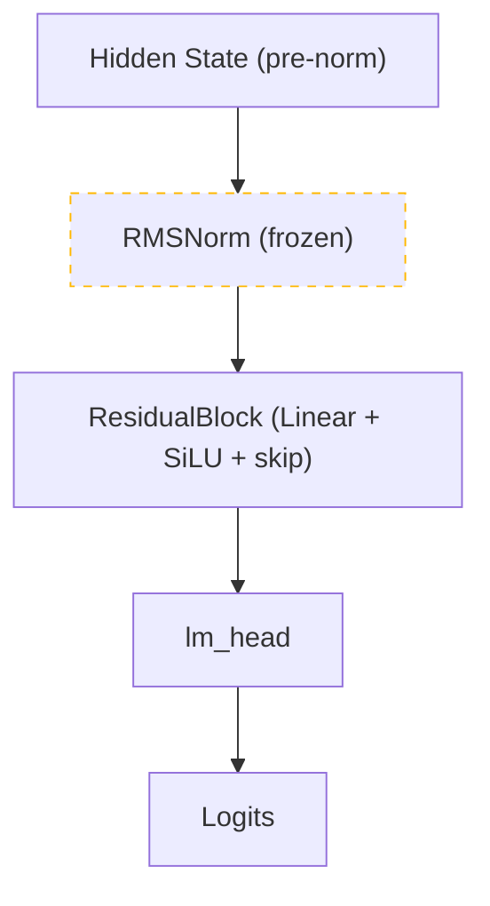
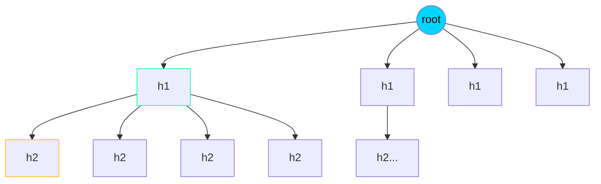

# Building a Speculative Decoding Engine from Scratch

*Custom Triton kernels, tree-structured attention, and four bugs that made it 12x slower than baseline.*

---

## The Problem with Autoregressive Inference

Large language model inference is fundamentally **memory-bandwidth bound**. Each token generation requires a full forward pass through the model, but the actual computation is dominated by moving weights from VRAM to compute units. The GPU's arithmetic units sit idle waiting for data. Generating 128 tokens means 128 sequential forward passes -- even though the GPU could handle more work per pass.

The arithmetic intensity of autoregressive decoding is roughly 1-2 FLOPs per byte of memory traffic, well below the ~300 ratio needed to fully utilize an A100. We are paying for 80GB of VRAM and 312 TFLOPS of compute, but only using the bandwidth.

**Speculative decoding** attacks this directly: use a cheap model to *draft* multiple tokens, then *verify* them all in a single backbone pass. If the drafts are good, you get multiple tokens for the price of one forward pass. If they are bad, you still get one token -- the same as normal decoding. The worst case is autoregressive speed; the best case is proportional speedup to the number of accepted tokens.

I built a full speculative decoding engine from scratch to understand how this works in practice. It did not go smoothly.

## The System

Project Gorgon implements Medusa-style speculative decoding for Llama-3-8B (4-bit quantized). The main components:

- **4 Medusa draft heads** -- lightweight MLPs attached to the backbone's hidden states, each predicting a different future token position
- **Tree-structured candidate generation** -- Cartesian product trees with adaptive pruning (confidence thresholds, path-probability products, entropy-weighted expansion)
- **Tree attention kernels** -- three implementations: Triton (127 LOC), CUDA (88 LOC), and a fused mask-free kernel (140 LOC)
- **Vectorized verification** -- single argmax over all candidates, single CPU transfer, no GPU syncs in the loop
- **KV cache with trim-on-reject** -- rejected branches are trimmed, not recomputed
- **Full benchmark harness** -- reproducible JSONL reports with per-iteration metrics


90 tests. End-to-end training, inference, and benchmarking.

## Results

### The Progression

| Stage | Head 0 Acc. | Speedup | What Changed |
|-------|-------------|---------|--------------|
| First benchmark (random heads) | 0.2% | 0.08x (12x slower) | Nothing loaded -- benchmarking random weights |
| After RMSNorm fix (step 10k) | 23.2% | 0.25x | Added frozen norm, fixed checkpoint loading |
| After hook optimization (step 30k) | 23.2% | 0.66x | Replaced output_hidden_states with forward hook |

### Final Benchmark (H100 80GB, 30k training steps)

| Metric | Baseline | Speculative |
|--------|----------|-------------|
| Tokens/second | 35.71 | 23.47 |
| Total time (2560 tokens) | 71.7s | 109.1s |

| Head | Acceptance Rate |
|------|----------------|
| Head 0 (next token) | 23.2% |
| Head 1 (+2 positions) | 7.9% |
| Head 2 (+3 positions) | 5.4% |
| Head 3 (+4 positions) | 3.2% |

**Mean accepted length (tau): 0.40 tokens per iteration.**

The system is still 0.66x baseline speed. Here is why, and what I learned getting it from 0.08x to 0.66x.

## Bug 1: Benchmarking Random Heads

The first A100 benchmark showed 0.2% acceptance and 0.08x speedup -- 12x slower than just running the model normally. My first instinct was that the heads needed more training. They did, but that was not the main problem.

The benchmark script called `load_backbone_4bit()` which creates fresh `MedusaHead` instances with randomly initialized weights. It had no `--heads-checkpoint` flag. The 10,000-step training run had produced checkpoints, but the benchmark never loaded them. I was measuring random heads.

**Fix:** Added `--heads-checkpoint` CLI flag and `load_trained_heads()` utility with format compatibility handling (torch.compile `_orig_mod.` prefix stripping, dtype casting, device placement).

## Bug 2: The Missing Normalization Layer

Llama-3 uses a pre-norm architecture:

```python
hidden = transformer_layers(input)    # pre-norm hidden state
normed = RMSNorm(hidden)              # model.norm
logits = lm_head(normed)              # projection to vocab
```

`outputs.hidden_states[-1]` returns the **pre-norm** hidden state. But our `lm_head` was initialized from the backbone's own lm_head, which expects **post-norm** input. The single ResidualBlock in each head had to simultaneously learn to approximate RMSNorm AND predict shifted tokens.

**Fix:** Copy the backbone's RMSNorm layer, freeze its parameters, prepend it to each head:



Now at initialization, each head computes `lm_head(RMSNorm(hidden))` -- the backbone's own next-token prediction. Training only needs to learn the delta for shifted positions.

## Bug 3: Dead Learning Rate Schedule

The cosine LR scheduler decayed to exactly 0.0 (no `eta_min`). The first training run did 10,000 steps. A resumed run from step 6,500 was in the tail of cosine decay with near-zero learning rate. Most effective training happened only in the first ~5,000 steps.

Additionally, the `load_config` function had a subtle override bug: CLI default values (e.g. `warmup_steps=50`) always overwrote the YAML config values (`warmup_steps=500`) because the function used direct assignment instead of `setdefault()`.

**Fix:** Set `eta_min=1e-5` so the LR never flatlines. Changed config loading to use `setdefault()` so YAML values are only overridden by explicitly passed CLI args.

## Bug 4: Verification Overhead

After fixing bugs 1-3 and retraining for 30k steps, the heads showed 23% acceptance on head 0. But the speedup was still only 0.25x. The time breakdown revealed the problem: measured draft + verify + kv_trim accounted for only ~8% of total elapsed time. Where was the other 92%?

The culprit: `output_hidden_states=True` on every verification forward pass. This forces the model to allocate and return hidden state tensors from **all 33 transformer layers** -- roughly 33 tensors of shape `(1, seq_len, 4096)`. We only needed the last one.

Meanwhile, the baseline used HuggingFace's optimized `model.generate()`, which never allocates hidden states.

**Fix:** Register a forward hook on `model.model.norm` (the final RMSNorm) to capture the post-norm hidden state directly. Falls back to `output_hidden_states=True` for models without the expected structure (test mocks).

```python
class _HiddenCapture:
    def register(self, model):
        target = model.model.norm
        def _hook(module, inp, out):
            self.hidden = out
        self._handle = target.register_forward_hook(_hook)
```

This brought verify time from ~10.1s to ~4.9s across the benchmark, improving speedup from 0.25x to 0.66x.

## Why It Is Still < 1x

At 0.66x, the speculative engine is still slower than baseline. The core issue:

**Mean accepted length (tau) is 0.40.** With the bonus token, each iteration yields ~1.4 tokens. But the verification pass processes all tree candidates (up to 30 with top_k=2), making it more expensive than a single autoregressive step. For speculative decoding to break even, tau needs to be high enough that the extra tokens per iteration outweigh the verification cost.

The Medusa paper reports 40-60% acceptance rates with 2+ tau. Our 23% on head 0 suggests the heads have not converged enough, or the training data (WikiText) does not transfer well to the benchmark prompts.

Paths to >1x that I would explore next:

1. **Better training data.** WikiText is encyclopedic text. The benchmark prompts may have different distribution. Training on a diverse corpus (RedPajama, SlimPajama) would likely improve generalization.
2. **Longer training.** The loss curve shows high variance and slow convergence. 100k+ steps with a lower LR might help.
3. **Per-head loss weighting.** Currently all 4 heads contribute equally to the loss. Weighting head 0 more heavily would prioritize the most impactful head.
4. **Smaller trees.** With low tau, the tree overhead dominates. Using fewer heads (1-2) with higher top_k might give better speedup than 4 heads with low acceptance.

## Tree-Structured Candidate Generation

Given 4 heads with top-k=4, the Cartesian product gives 4 + 16 + 64 + 256 = 340 candidates. That is too many for 23% head-0 acceptance. We implemented three pruning strategies:



**Confidence threshold.** Prune candidates with softmax probability below a threshold.

**Path-probability product.** Track cumulative probability along each root-to-leaf path. Deep branches with low cumulative confidence are pruned.

**Entropy-weighted thresholds.** Scale the threshold by `(1 - normalized_entropy)` per head. Uncertain heads get lower thresholds, allowing broader exploration. Confident heads are pruned aggressively.

With `top_k=2`, the tree shrinks to 2 + 4 + 8 + 16 = 30 candidates -- much less verification overhead.

## Custom GPU Kernels

Three implementations of tree attention:

**Triton kernel** (127 LOC). Parameterized by `BLOCK_N` and `BLOCK_D`, with masked softmax. The tree mask is pre-materialized as an (N, N) boolean tensor.

**CUDA kernel** (88 LOC). Shared-memory softmax with per-block parallelism. Direct control over memory layout.

**Fused mask-free kernel** (140 LOC). The key insight: the tree structure is fully described by a compact `parents` array of N int32 values. Instead of materializing an (N, N) mask, the kernel walks the parents array in registers to compute ancestor relationships on-the-fly:

```python
@triton.jit
def _fused_tree_verify_kernel(Q, K, V, Parents, Out, ..., MAX_DEPTH: tl.constexpr):
    row = tl.program_id(0)
    # Build ancestor bitmask by walking parents (unrolls at compile time)
    ancestor_mask = 1 << row
    cur = row
    for _ in tl.static_range(0, MAX_DEPTH):
        p = tl.load(Parents + cur)
        ancestor_mask |= tl.where(p >= 0, 1 << p, 0)
        cur = tl.where(p >= 0, p, cur)
    # Use bitmask instead of loading N booleans from global memory
```

For N=340 candidates, this replaces 115,600 booleans with 340 int32 values -- a 340x reduction in mask memory. The ancestor walk is 3-5 scalar loads per row for typical Medusa trees (depth 3-5).

Having three implementations means each validates the others. Any disagreement beyond floating-point tolerance is a bug.

## Training

### Training Loss Curve


30,000 steps on WikiText-103 with 4 Medusa heads. The loss drops quickly from ~10 to ~5 in the first 1,000 steps, then oscillates between 3-7 for the rest of training. Minimum loss: 2.83 at step ~18,000. The high variance reflects the difficulty of predicting tokens 2-4 positions ahead -- some sequences are predictable, others are not.

Training config: 3e-4 peak LR with 500-step warmup, cosine decay to 1e-5, effective batch size 16, bf16 mixed precision. ~97 minutes on H100 80GB.

### Knowledge Distillation

The heads are trained via distillation from the frozen backbone:

1. Run backbone on WikiText with `torch.no_grad()` to get hidden states
2. Head *k* receives hidden state at position *t*, predicts ground truth token at *t + k*
3. Loss = cross-entropy between head logits and shifted targets
4. Only head parameters (~8M total for 4 heads) receive gradients

Training uses all sequence positions (`hidden[:, :-k, :] -> targets[:, k:]`), giving ~500x more signal per batch than last-token-only distillation.

## Per-Iteration Instrumentation

Every speculative iteration records an `IterationStats`:

- `tree_size` and `accepted_length` for tree utilization
- `head_acceptance: List[bool]` for per-head breakdown
- `time_draft_ms`, `time_verify_ms`, `time_kv_trim_ms` for timing

Aggregate metrics: mean accepted length (tau), per-head acceptance rates, tree utilization (fraction of tree nodes accepted). These feed into the ablation runner which sweeps (num_heads, top_k, depth, confidence_threshold) to find the Pareto frontier.

## What I Would Do Differently

**Validate before training.** Before committing to 10,000 training steps, I should have verified that freshly initialized heads (with backbone lm_head weights) could at least approximate head-0 accuracy on a few examples. A 100-step sanity check would have caught the RMSNorm issue immediately.

**Benchmark with checkpoint loading from day one.** The missing `--heads-checkpoint` flag was embarrassing. Every benchmark script should accept a checkpoint path. Test the inference path end-to-end before investing in training.

**Profile early.** The `output_hidden_states` overhead was invisible until I added timing instrumentation. Adding `IterationStats` and time breakdowns from the start would have revealed this on the first benchmark run.

**Start with 1-2 heads.** Four heads is ambitious. Head 0 is by far the most impactful (23% vs 3-8% for deeper heads). Starting with a single head, getting it to 50%+ acceptance, then adding more would have been a better strategy.

---

*Project Gorgon is open source at [github.com/matteso1/ProjectGorgon](https://github.com/matteso1/ProjectGorgon). 90 tests, three GPU kernels, and four bugs that each taught me something.*
